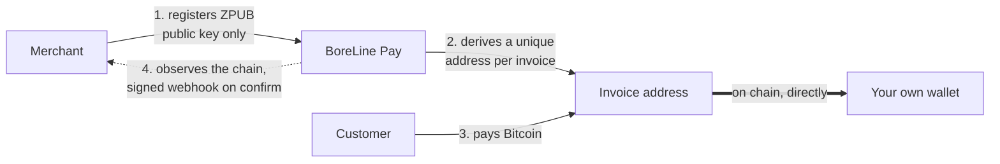
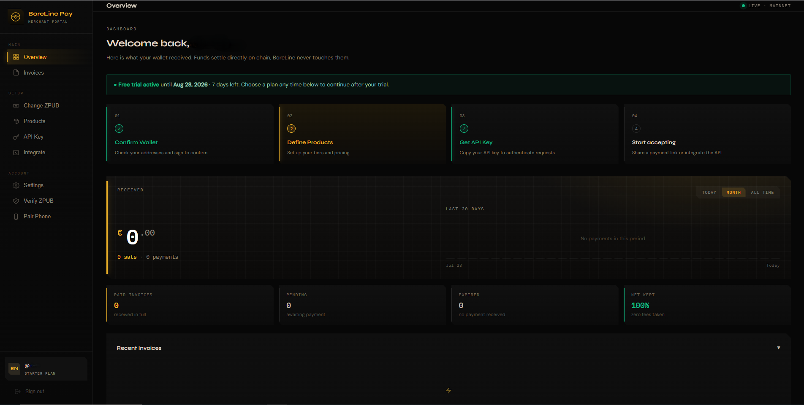
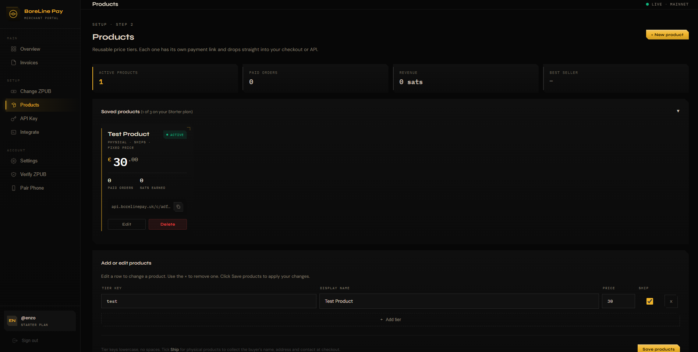
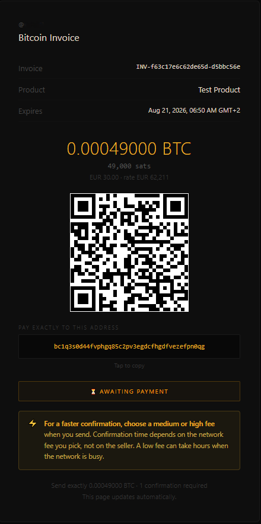
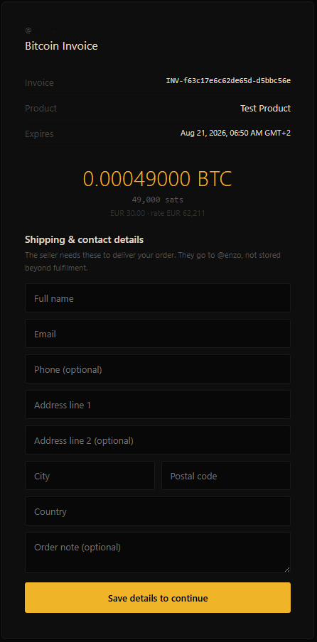
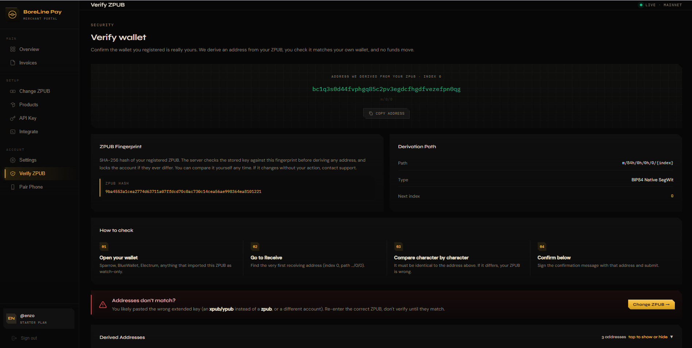
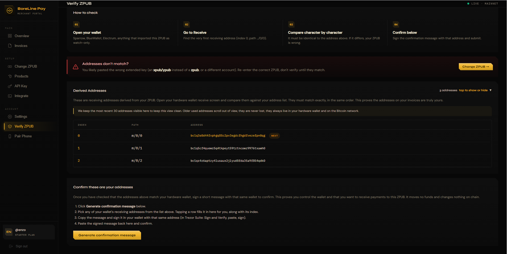

# BoreLine Pay

### Accept Bitcoin. Own every sat.

[](LICENSE)   

**Non-custodial Bitcoin payment infrastructure.** Accept Bitcoin payments that settle directly to a wallet only you control. BoreLine never holds, touches, or is able to move your funds at any point.

- Website: https://boreline.app
- Whitepaper: https://boreline.app/whitepaper
- Integration guide: https://boreline.app/integrate
- Security guide: https://boreline.app/security

> This repository is public documentation and example code. It contains **no** server code, credentials, or anything that could compromise a merchant account. It exists to explain how BoreLine works and to help developers integrate.

---

## What it is

BoreLine Pay lets a business accept Bitcoin without a custodian standing between the business and its money.

You register the extended public key (**ZPUB**, a BIP84 native SegWit *watch-only* key) from your own hardware wallet. From that key alone, BoreLine:

1. derives a unique Bitcoin address for each invoice,
2. watches the public blockchain for the payment, and
3. notifies your site the moment it confirms.

The Bitcoin goes **straight from your customer to your own wallet**. It never passes through BoreLine. That is a structural property of the design, not a policy we could change.

## How it works



The green path, the money, never touches BoreLine. BoreLine only reads the public chain and derives addresses from a public key.

## Screenshots

### Merchant dashboard

Register your ZPUB, define products, and watch payments settle straight to your wallet. BoreLine takes zero fees and never touches the funds.



### Products and payment links

Reusable price tiers, each with its own hosted payment link that drops into a checkout or the API.



### What your customer sees

A hosted Bitcoin payment page with the exact amount, a QR code, and a receiving address derived from your own wallet.



For physical products, the same page collects the buyer's shipping and contact details first, no extra code on your side.



### Verify, do not trust

The Verify page shows the derivation path, the ZPUB fingerprint, and the derived addresses, so you can confirm them against your own wallet before going live.



The derived-address list lines up character for character with your own wallet, and with the [`verifiable-core/`](verifiable-core/) script in this repo.



## Why it is safe by design

- **Non-custodial.** BoreLine cannot hold, freeze, reverse, or move your funds. There is no balance held on your behalf.
- **Watch-only key.** A ZPUB can generate receiving addresses but can never spend. Your private keys and seed phrase never leave your hardware wallet, and BoreLine never sees them.
- **Tamper detection.** BoreLine stores a SHA-256 fingerprint of your ZPUB and re-checks it before deriving any address. If it ever fails to match, the account locks and no payment can be routed to an altered key.
- **No passwords.** You authenticate by signing a challenge with your hardware wallet. API keys are stored only as SHA-256 hashes.
- **Verify, do not trust.** A dashboard verification page shows the derivation path, the fingerprint, and the derived addresses so you can confirm them against your own wallet before going live.

## Verify it yourself (open source core)

You do not have to take the non-custodial claim on faith. The [`verifiable-core/`](verifiable-core/) folder contains the **exact address-derivation logic BoreLine uses**, as a standalone, dependency-free Python module you can read and run. It proves that every invoice address is a standard BIP84 address derived from your own public key, so payments can only land in a wallet you control.

```bash
cd verifiable-core
python derive.py <your-zpub> 5     # print your first addresses + fingerprint
python test_vectors.py             # verify the code against the BIP84 spec
```

Line up the output against your own wallet (Sparrow, Electrum, ...) and BoreLine's Verify page. If all three match, non-custody is proven, not promised. The module contains no secrets, no keys, and makes no network calls. See [`verifiable-core/README.md`](verifiable-core/README.md).

## Two ways to integrate

| Path | For whom | Needs code? |
|------|----------|-------------|
| **No-code payment links** | Most sellers. One link per product. Safe to share publicly, it carries no secret. | No |
| **REST API + signed webhooks** | Custom checkouts and automatic order fulfilment. | Yes, a backend |

### Quick look at the API

Create an invoice from **your backend** (never the browser):

```http
POST https://api.borelinepay.uk/api/invoice
X-API-Key: your_secret_api_key
Content-Type: application/json

{ "tier": "starter", "email": "customer@example.com", "months": 1 }
```

Response:

```json
{
  "invoice_url": "https://api.borelinepay.uk/pay/INV-...",
  "amount_sats": 51275,
  "fiat_amount": 29.00,
  "currency": "EUR",
  "expires_at": "2026-06-17T12:00:00Z"
}
```

Redirect the customer to `invoice_url`. BoreLine sends a signed webhook to your site when the payment confirms. Runnable examples are in [`examples/`](examples/), and the full reference is in [`docs/api-reference.md`](docs/api-reference.md).

## Pricing

A flat monthly subscription, paid in Bitcoin, with **no percentage taken from any transaction**.

| Plan | Price |
|------|-------|
| Starter | EUR 29 / month |
| Pro | EUR 49 / month |
| Business | EUR 99 / month |

A **7-day free trial** with the full Starter feature set requires no payment. Verify the whole flow with a fresh empty wallet before committing a cent.

## How BoreLine compares

There are three broad ways to accept Bitcoin. BoreLine sits deliberately in the gap between a hosted convenience product and running your own server.

| | **BoreLine Pay** | Custodial processors (e.g. BitPay, OpenNode) | Self-hosted (e.g. BTCPay Server) |
|---|---|---|---|
| Custody of funds | **Non-custodial**, funds never touch BoreLine | Custodial, they hold then settle to you | Non-custodial |
| Where the money lands | **Your own wallet, directly on chain** | Their account first, then paid out to you | Your own wallet |
| Fees | **Flat monthly, no percentage per sale** | A percentage of each transaction | Free software, you pay hosting and upkeep |
| Setup | Register a ZPUB, nothing to host | Sign up | Deploy and maintain your own server |
| Who holds the keys | **You only**, on your hardware wallet | The provider, until payout | You only |
| Best for | Non-custodial payments without running infrastructure | Convenience and built-in fiat conversion | Technical users who want to self-host everything |

The trade-off is simple: custodial processors are convenient but hold your money and take a cut; self-hosting keeps custody but you run the server. BoreLine keeps the funds in your own wallet like self-hosting, while staying hosted and zero-maintenance like a processor, for a flat fee. These are general characteristics, always check each provider's current terms.

## Documentation in this repo

- [`docs/how-it-works.md`](docs/how-it-works.md) , the model and the payment lifecycle in plain terms
- [`docs/security-model.md`](docs/security-model.md) , what is stored, what is never seen, and the trust model
- [`docs/threat-model.md`](docs/threat-model.md) , what an attacker can and cannot do, scenario by scenario
- [`docs/verify-it-yourself.md`](docs/verify-it-yourself.md) , prove non-custody independently, do not trust, verify
- [`docs/api-reference.md`](docs/api-reference.md) , the invoice endpoint and webhook, field by field
- [`docs/faq.md`](docs/faq.md) , common questions
- [`verifiable-core/`](verifiable-core/) , the real address-derivation logic, runnable, so you can verify non-custody yourself

## Contact

Questions, security disclosure, or integration help: **borelineapp@proton.me**

Responsible disclosure is welcome. BoreLine Pay will never ask for your seed phrase or private keys, and neither will anyone legitimate.

## Contributing and security

Contributions to the docs and examples are welcome, see [`CONTRIBUTING.md`](CONTRIBUTING.md). To report a vulnerability, see [`SECURITY.md`](SECURITY.md) and email **borelineapp@proton.me** privately. Please do not open a public issue for a security problem.

## License

The example code and documentation in this repository are released under the [MIT License](LICENSE). "BoreLine Pay" and the BoreLine brand are property of BoreLine Pay.
