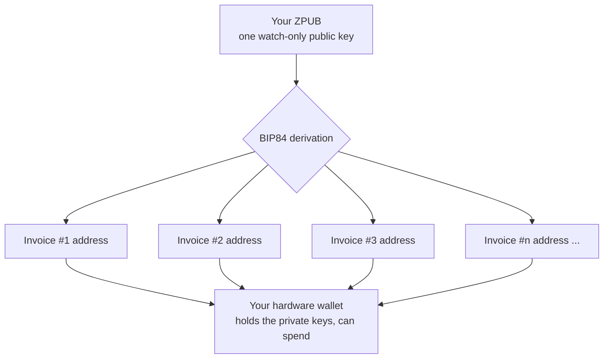
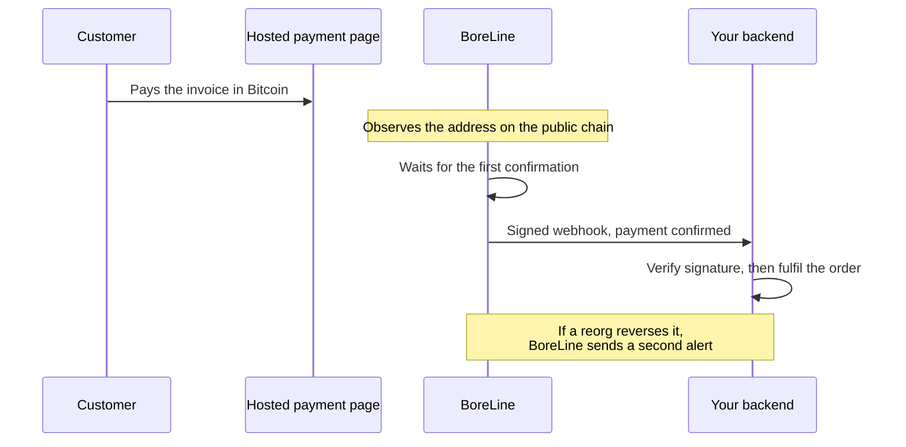

# How BoreLine Pay works

BoreLine Pay is payment infrastructure, not a wallet and not a custodian. This page explains the model and the full payment lifecycle in plain terms.

## The core idea

A traditional processor receives your customer's money, holds a balance, and settles to you later, often taking a percentage and keeping the power to freeze or reverse. BoreLine removes that middle party.

You register the **ZPUB** of your hardware wallet's native SegWit account. A ZPUB is an *extended public key*. It can generate a limitless sequence of receiving addresses, but it cannot spend from any of them. Giving it to BoreLine is not handing over custody, it is handing over the ability to generate your own addresses.

From that one public key, BoreLine derives a fresh address for every invoice using the standard BIP84 derivation path. The customer pays that address. The Bitcoin lands in your wallet directly, on chain. BoreLine only watches the public blockchain to tell you when it arrived.

### One key, a unique address per invoice

Every invoice gets its own address, so payments are not linked to one another, and every one of those addresses is controlled only by your hardware wallet. BoreLine can generate them but can never spend from them.

## The payment lifecycle

1. **Invoice created.** A unique address is derived from your ZPUB and assigned to the invoice, along with an amount and an expiry window.
2. **Customer pays.** The customer sends Bitcoin to that address from any wallet. The transaction is broadcast to the network.
3. **Detection.** BoreLine observes the incoming transaction on chain, requiring the full amount and a timestamp after the invoice was created.
4. **Confirmation.** On the first confirmation, the invoice is marked paid and your site is notified through its webhook. BoreLine keeps watching to guard against a chain reorganisation.
5. **Late payments.** If a payment arrives after expiry, for example during network congestion, BoreLine keeps observing the address for a grace period and alerts you if funds arrive, so nothing is silently lost.

### The confirmation flow, end to end

The money moves directly from the customer to your wallet on chain. BoreLine only reads the chain and tells your backend what happened.

## Two integration paths

### No-code payment links

Register your ZPUB, define your products (each a name and price), and copy the ready-made payment link for each product from your dashboard. Put the link on a button, in an email, or in a bio. When opened, it shows a hosted Bitcoin payment page with the amount and a QR code. The link carries no secret and is safe to share publicly, it can only ever create a payment to your own wallet for that product.

### REST API with signed webhooks

When you want payments inside your own checkout, or automatic fulfilment the moment a payment confirms:

1. Your button calls **your own backend**.
2. Your backend holds your API key and calls the BoreLine invoice endpoint.
3. BoreLine returns a payment page link, and your backend sends the customer there.
4. When the payment confirms, BoreLine sends a **signed webhook** to your site so you can unlock the order, grant access, or send a download.

The critical rule: **your API key lives only on your backend, never in the browser.** See [`api-reference.md`](api-reference.md) for the exact request and response shapes, and [`../examples/`](../examples/) for runnable code.

## What about shipping physical goods?

Any product can have **Ship** enabled. If you redirect the customer to the returned `invoice_url` (the same hosted page the no-code links use), the buyer is asked for their name, address, and contact before paying. Those details appear against the paid order in your dashboard and in your webhook. BoreLine stores them only to pass to you and deletes them automatically after 90 days. For digital products, leave Ship off and nothing personal is collected.
